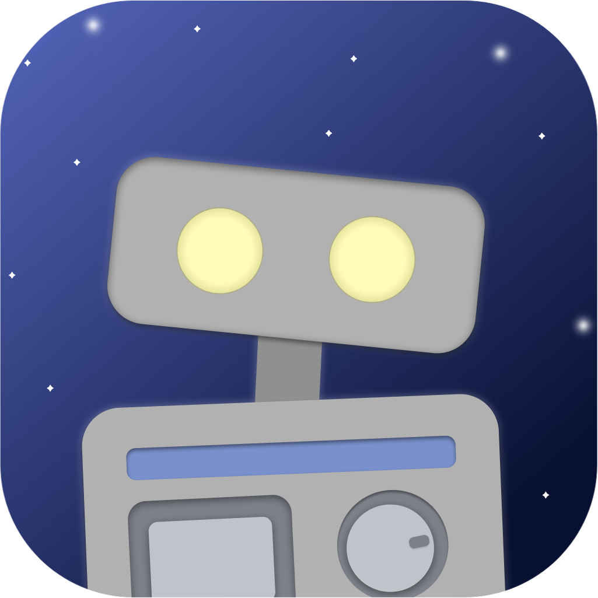
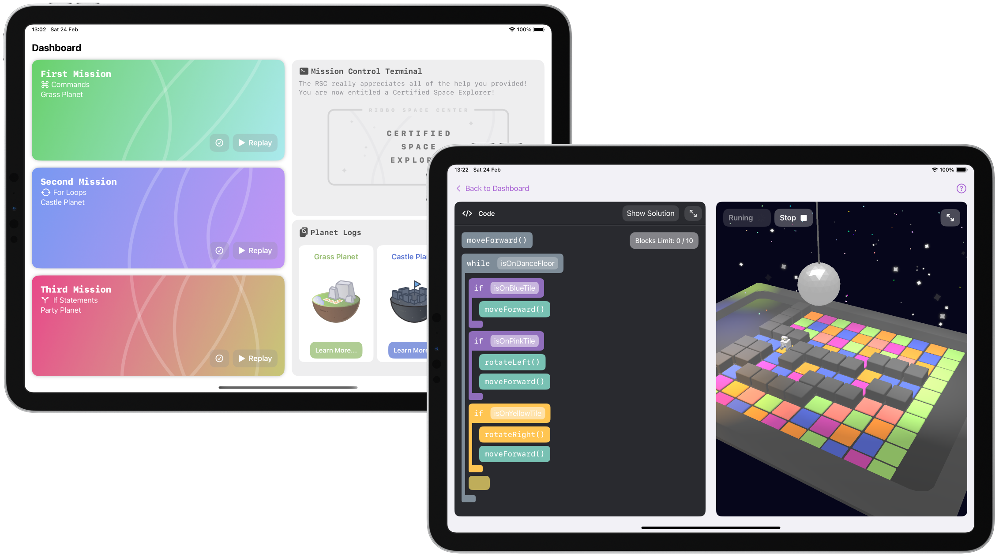

<h1> Ribbo's Adventure
  
</h1>

 

<!-- 

  
  

 -->

## About
PawTask is an app that teaches users some basic principles about programming, through an interactive game experience. Join Ribbo, Ribbo Space Center's newest robot in its missions through space and help it go through challenging landscapes by creating a series of algorithms!

## Run device
The app was made, primarly for iPad devices. It can also be run through the Xcode simulator or MacCatalyst.

## Assets and models
All of the app's assets and the 3D scenes were made by me!

## Features
- [x] Add any task you'd like, with a title, a description and a time estimative for it
- [x] Ability to edit all of the details of each task
- [x] Sort your tasks based on your priorities, so that the most important ones are done first
- [x] Earn coins and customize Cooper by buying him apparel
- [x] No internet required to run the app
- [x] Reminders to take a break after completing long tasks
- [x] Simple and minimal design

## Next Features
- [ ] Add support for different projects, in which tasks can be organized 
- [ ] Find a better and more secure way to store the user's tasks
- [ ] Finish dark mode support
- [ ] Add even more things to buy with the coins, and add app color customizations
- [ ] Add task deadlines and auto-sorting
- [ ] Add support to plan for multiple days
